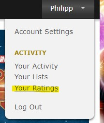
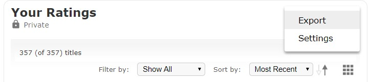

# IMDb Ratings Visualizer

Live Demo: [https://phartenfeller.github.io/imdb-ratings-visualizer/](https://phartenfeller.github.io/imdb-ratings-visualizer/)

Upload a CSV-Export of your IMDb Ratings and view statistics to them.

## How to export your Ratings

You need to be logged in to do this. Click on your account and select `Your Ratings`:

After that you can click on the three dots and select `Export`:

A CSV-File with your ratings will be downloaded-
